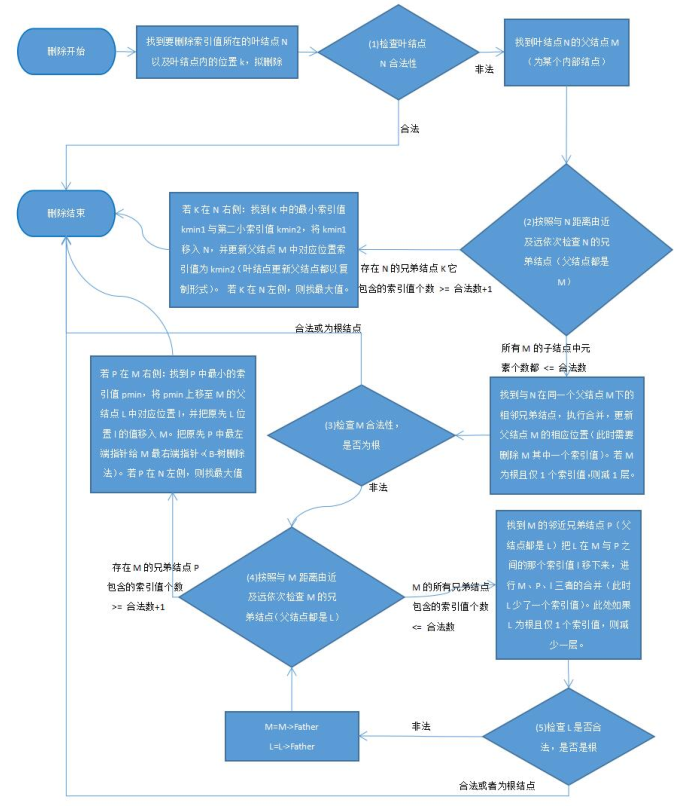
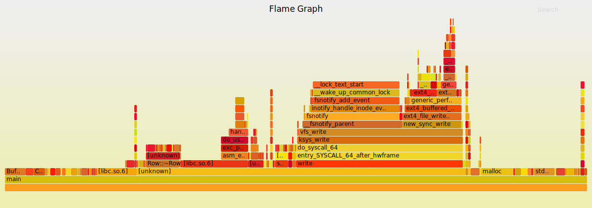

# MiniSQL

## 介绍

database-project-2022

2022数据库大程

## 课程连接

https://git.zju.edu.cn/zjucsdb/minisql

https://www.yuque.com/yingchengjun/pcp6qx/fggii4

## 提交记录


# 个人详细设计报告

## **1. SQL EXECUTOR**

### 模块概述

SQL EXECUTOR 根据解释器（Parser）生成的语法树，通过Catalog Manager 提供的信息生成执行计划，并调用 Record Manager、Index Manager 和 Catalog Manager 提供的相应接口进行执行，最后输出对应结果。

### 原理介绍

#### PrimaryKey的实现

CreateTable时会自动为PrimaryKey的若干列建立B+树索引 (名称为"\_tableName\_PK\_")，

并且会将PrimaryKey中各列的Index存储在TableMeta的属性vector<uint32_t> PrimaryKeyIndexs中，

后续插入时都会通过索引查询是否有重复。

查询得到一个属性集合上的索引主要通过函数GetIndexesForKeyMap：

​	`dberr_t CatalogManager::GetIndexesForKeyMap(const std::string &table_name, const vector<uint32_t> &key_map, vector<IndexInfo*> &index_infos) const`

​	提供table_name和属性集合的key_map(即在fields中的index集合)即可得到对应的index_infos。

#### Unique的实现

CreateTable时自动为Unique列建立B+树索引 (名称为"\_tableName\_UNI\_uniqueKeyName\_")，

后续插入时都会通过索引查询是否有重复。

#### CreateIndex的实现

能否CreateIndex的标准是：属性集合中有一个Unique，或实际上没有重复。

如果实际上没有重复(通过插入B+树的返回值进行判断)，也允许CreateIndex，并且在CreateIndex之后会将该列标记为Unique。

这样设计方便观察建立索引产生的加速效果。

#### where判断的实现

主要的相关函数有：

- `CmpBool GetResultOfNode(const pSyntaxNode &ast, const Row &row, TableSchema *schema)`

  通过递归遍历where语句的语法树，自底向上地返回判断结果(kTrue, kFalse, kNull)，主要处理and和or。

- `CmpBool GetCompareResult(const pSyntaxNode &ast, const Row &row, TableSchema *schema)`

  获得一个CompareOperator的节点的判断结果，包括 '=', '<>', '<=', '>=', '<', '>', is, not。

```c++
// new: get the result of a CompareOperator node 
// operators '=', '<>', '<=', '>=', '<', '>', is, not
CmpBool GetCompareResult(const pSyntaxNode &ast, const Row &row, TableSchema *schema) {
  string fieldName = ast->child_->val_;
  uint32_t fieldIndex;
  schema->GetColumnIndex(fieldName, fieldIndex);
  TypeId type = schema->GetColumn(fieldIndex)->GetType();

  Field tempField(type); // null now
  if (ast->child_->next_->type_ != kNodeNull){
    string rhs = ast->child_->next_->val_;
    tempField.FromString(rhs);
  }
  
  if (string(ast->val_) == "="){
    return row.GetField(fieldIndex)->CompareEquals(tempField);
  }else if (string(ast->val_) == "<>"){
    return row.GetField(fieldIndex)->CompareNotEquals(tempField);
  }else if (string(ast->val_) == "<="){
    return row.GetField(fieldIndex)->CompareLessThanEquals(tempField);
  }else if (string(ast->val_) == ">="){
    return row.GetField(fieldIndex)->CompareGreaterThanEquals(tempField);
  }else if (string(ast->val_) == "<"){
    return row.GetField(fieldIndex)->CompareLessThan(tempField);
  }else if (string(ast->val_) == ">"){
    return row.GetField(fieldIndex)->CompareGreaterThan(tempField);
  }else if (string(ast->val_) == "is"){
    return GetCmpBool(row.GetField(fieldIndex)->IsNull() == tempField.IsNull());
  }else if (string(ast->val_) == "not"){
    return GetCmpBool(row.GetField(fieldIndex)->IsNull() != tempField.IsNull());
  }else{
    LOG(ERROR) << "Unknown kNodeCompareOperator val: " << string(ast->val_) << endl;
    return kFalse;
  }
}

// new: get the result of a node (kTrue, kFalse, kNull)
CmpBool GetResultOfNode(const pSyntaxNode &ast, const Row &row, TableSchema *schema) {
  if (ast == nullptr) {
    LOG(ERROR) << "Unexpected nullptr." << endl;
    return kFalse;
  }
  CmpBool l, r;
  switch (ast->type_) {
    case kNodeConditions: // where
      return GetResultOfNode(ast->child_, row, schema);
    case kNodeConnector: // and, or
      l = GetResultOfNode(ast->child_, row, schema);
      r = GetResultOfNode(ast->child_->next_, row, schema);
      switch (ast->val_[0]) {
        case 'a': // & and
          if (l == kTrue && r == kTrue) {
            return kTrue;
          } else if (l == kFalse || r == kFalse) {
            return kFalse;
          } else {
            return kNull;
          }
        case 'o': // | or
          if (l == kTrue || r == kTrue) {
            return kTrue;
          } else if (l == kFalse && r == kFalse) {
            return kFalse;
          } else {
            return kNull;
          }
        default:
          LOG(ERROR) << "Unknown connector: " << string(ast->val_) << endl;
          return kFalse;
      }
    case kNodeCompareOperator: /** operators '=', '<>', '<=', '>=', '<', '>', is, not */
      return GetCompareResult(ast, row, schema);
    default:
      LOG(ERROR) << "Unknown node type: " << ast->type_ << endl;
      return kFalse;
  }
  return kFalse;
}
```

调用`GetResultOfNode(whereNode, *row, table_schema)`即可得到where语句的判断结果。

### 索引加速的实现

在ExecuteEngine下添加了canAccelerate函数：

`uint8_t canAccelerate(pSyntaxNode whereNode, TableInfo* &table_info, CatalogManager* &cat, vector<Row*> &result)`

   * 输入: whereNode, table_info and CatalogManager.

   * 输出: (如果成功实施加速) result rows.

   *  返回值: 
      *  0b000: 未实施任何加速。
         *  这意味着后续处理where语句需要遍历整个表。

      *  0b001: 实施了部分加速，后续仍需过滤(filter)。
         *  对应的情形是where中的限制条件中只有部分属性上建有索引
            *  例如 where id = 1 and name = "yj" 其中id上有索引，name上没有索引
               这时函数会返回所有id = 1的Rowid，并且通过返回值提示后续需要再过滤(即筛选出其中name = "yj"的Rowid)

      *  0b010: 实施了全部加速，后续不再需要过滤。
         *  对应的情形是where中的限制条件中只有所有属性上都建有索引
      
         (使用二进制返回值是希望后续的分支判断只需要位运算，从而加速)

实现细节上：

- canAccelerate通过B+树寻找临界值并且依次迭代实现了**范围索引**；
- canAccelerate通过首先判断where中各个属性是否为primaryKey对应的属性，
  如果是则直接通过primaryKey的索引查询RowId并返回；
  如果不是primaryKey，则逐一判断各个属性上是否具有索引，如果有则查询出一组对应的RowId，
  最后将各组RowId进行join操作，从而实现了**部分索引** (即限制条件中只有部分属性上建有索引也可通过索引加速)。

之后ExecuteEngine中的select、delete、update函数只需根据canAccelerate相应的返回值，做出如下处理：

* 0b000：遍历整个表。
* 0b001：对canAccelerate产生的结果过滤，即对返回的result rows逐一判断是否符合where限制。
* 0b010：无需过滤，直接把canAccelerate产生的result rows作为最终结果。

### 具体实现

**接口文件 execute_engine.h**

```c++
class ExecuteEngine {
public:
  ExecuteEngine();

  ~ExecuteEngine() {
    for (auto it : dbs_) {
      delete it.second;
    }
  }

  /**
   * executor interface
   */
  dberr_t Execute(pSyntaxNode ast, ExecuteContext *context);

private:

  /** new:
   *  input: whereNode, table_info and CatalogManager.
   *    return: 
   *      0b000: not possible to accelerate;
   *      0b001: possible to accelerate, need filter;
   *      0b010: possible to accelerate, no filter;
   *    if possible, output: result rows.
   **/
  uint8_t canAccelerate(pSyntaxNode whereNode, TableInfo* &table_info, CatalogManager* &cat,
                      vector<Row*> &result);

  dberr_t ExecuteCreateDatabase(pSyntaxNode ast, ExecuteContext *context);

  dberr_t ExecuteDropDatabase(pSyntaxNode ast, ExecuteContext *context);

  dberr_t ExecuteShowDatabases(pSyntaxNode ast, ExecuteContext *context);

  dberr_t ExecuteUseDatabase(pSyntaxNode ast, ExecuteContext *context);

  dberr_t ExecuteShowTables(pSyntaxNode ast, ExecuteContext *context);

  dberr_t ExecuteCreateTable(pSyntaxNode ast, ExecuteContext *context);

  dberr_t ExecuteDropTable(pSyntaxNode ast, ExecuteContext *context);

  dberr_t ExecuteShowIndexes(pSyntaxNode ast, ExecuteContext *context);

  dberr_t ExecuteCreateIndex(pSyntaxNode ast, ExecuteContext *context);

  dberr_t ExecuteDropIndex(pSyntaxNode ast, ExecuteContext *context);

  dberr_t ExecuteSelect(pSyntaxNode ast, ExecuteContext *context);

  dberr_t ExecuteInsert(pSyntaxNode ast, ExecuteContext *context);

  dberr_t ExecuteDelete(pSyntaxNode ast, ExecuteContext *context);

  dberr_t ExecuteUpdate(pSyntaxNode ast, ExecuteContext *context);

  dberr_t ExecuteTrxBegin(pSyntaxNode ast, ExecuteContext *context);

  dberr_t ExecuteTrxCommit(pSyntaxNode ast, ExecuteContext *context);

  dberr_t ExecuteTrxRollback(pSyntaxNode ast, ExecuteContext *context);

  dberr_t ExecuteExecfile(pSyntaxNode ast, ExecuteContext *context);

  dberr_t ExecuteQuit(pSyntaxNode ast, ExecuteContext *context);

private:
  [[maybe_unused]] std::unordered_map<std::string, DBStorageEngine *> dbs_;  /** all opened databases */
  [[maybe_unused]] std::string current_db_;  /** current database */
};

```

**属性**

* std::unordered_map<std::string, DBStorageEngine *> dbs_：存储Database名称到实际对象的映射。
* std::string current_db_：当前use的Database。

**方法**

- 构造函数：

  ​	首先判断是否存在databases.txt，不存在则无需恢复数据；

  ​	<u>存在则需从databases.txt中获得各个database的名称，并且调用DBStorageEngine的构造函数从而恢复数据。</u>

- 创建Table：ExecuteEngine::ExecuteCreateTable(*ast, *context)

  ​	通过语法树得到Table各列的要求，并且调用CatalogManager中的CreateTable。

  ​	<u>同时为该Table的PrimaryKey和所有UniqueKey也都建立了对应的索引(便于后续进行约束检查)。</u>

- 删除Table：ExecuteEngine::ExecuteDropTable(*ast, *context)

  ​	调用CatalogManager中的DropTable从而删除Table。

  ​	<u>同时也删除了该Table所有的索引。</u>

- 创建索引：ExecuteEngine::ExecuteCreateIndex(*ast, *context)

  ​	调用CatalogManager中的CreateIndex从而创建索引。

  ​	<u>如果属性集合中有一个Unique，或实际上没有重复，就允许创建索引。</u>

  ​	如果实际上没有重复(通过插入B+树的返回值进行判断)，也允许CreateIndex，并且在CreateIndex之后会将该列标记为Unique。这样设计方便观察建立索引产生的加速效果。

- 删除索引：ExecuteEngine::ExecuteDropIndex(*ast, *context)

  ​	<u>由于Parser的限制，会删除所有同名的Index。(parser不支持为特定的Table删除索引)</u>

- 选择：ExecuteEngine::ExecuteSelect(*ast, *context)

  ​	借助canAccelerate加速得到所有Row，并且借助在Field中新加的ToString方法把结果都存到二维字符串数组select_result中，再进行格式化输出。

  ​	<u>格式化输出会通过获得各列的最大宽度，借助iomanip.h提供的setw等函数输出间距合理的查询结果。</u>

- 插入：ExecuteEngine::ExecuteInsert(*ast, *context)

  ​	<u>插入前会先检查PrimaryKey和UniqueKey的约束，插入后会维护相应Table的索引。</u>

- 删除：ExecuteEngine::ExecuteDelete(*ast, *context)

  ​	<u>删除后会维护相应Table的索引。(删除前无需检查PrimaryKey和UniqueKey的约束)</u>

- 更新：ExecuteEngine::ExecuteUpdate(*ast, *context)

  ​	<u>更新前会先检查PrimaryKey和UniqueKey的约束，更新后会维护相应Table的索引。</u>

- 执行文件：ExecuteEngine::ExecuteExecfile(*ast, *context)

  ​	<u>支持多行的指令，也支持注释(将以"--"开头的行视为注释)。</u>

下列方法不过多赘述：

- CreateDatabase：ExecuteEngine::ExecuteCreateDatabase(*ast, *context)：
- DropDatabase：ExecuteEngine::ExecuteDropDatabase(*ast, *context)
- ShowDatabases：ExecuteEngine::ExecuteShowDatabases(*ast, *context)
- UseDatabase：ExecuteEngine::ExecuteUseDatabase(*ast, *context)
- ShowTables：ExecuteEngine::ExecuteShowTables(*ast, *context)
- ShowIndexes：ExecuteEngine::ExecuteShowIndexes(*ast, *context)
- Quit：ExecuteEngine::ExecuteQuit(*ast, *context)

## 2. **INDEX MANAGER**

### 模块概述

Index Manager 负责数据表索引的实现和管理，包括：索引的创建和删除，索引键的等值查找，索引键的范围查找（返回对应的迭代器），以及插入和删除键值等操作，并对外提供相应的接口。该模块使用B+树作为索引的数据结构。

### 原理介绍

插入流程：


删除流程：



### 具体实现

**接口文件** **b_plus_tree.h**

```c++

INDEX_TEMPLATE_ARGUMENTS
class BPlusTree {
  using InternalPage = BPlusTreeInternalPage<KeyType, page_id_t, KeyComparator>;
  using LeafPage = BPlusTreeLeafPage<KeyType, ValueType, KeyComparator>;

public:
  explicit BPlusTree(index_id_t index_id, BufferPoolManager *buffer_pool_manager, const KeyComparator &comparator,
                     int leaf_max_size = LEAF_PAGE_SIZE, int internal_max_size = INTERNAL_PAGE_SIZE);

  // new: destroy childs recursively
  void DestroyChilds(page_id_t node_pid);

  // Returns true if this B+ tree has no keys and values.
  bool IsEmpty() const;

  // Insert a key-value pair into this B+ tree.
  bool Insert(const KeyType &key, const ValueType &value, Transaction *transaction = nullptr);

  // Remove a key and its value from this B+ tree.
  void Remove(const KeyType &key, Transaction *transaction = nullptr);

  // return the value associated with a given key
  bool GetValue(const KeyType &key, std::vector<ValueType> &result, Transaction *transaction = nullptr);

  INDEXITERATOR_TYPE Begin();

  INDEXITERATOR_TYPE Begin(const KeyType &key);

  INDEXITERATOR_TYPE End();

  // expose for test purpose
  B_PLUS_TREE_LEAF_PAGE_TYPE *FindLeafPage(const KeyType &key, bool leftMost = false);

  // used to check whether all pages are unpinned
  bool Check();

  // destroy the b plus tree
  void Destroy();

  void PrintTree(std::ofstream &out) {
    if (IsEmpty()) {
      return;
    }
    out << "digraph G {" << std::endl;
    Page *root_page = buffer_pool_manager_->FetchPage(root_page_id_);
    BPlusTreePage *node = reinterpret_cast<BPlusTreePage *>(root_page);
    ToGraph(node, buffer_pool_manager_, out);
    out << "}" << std::endl;
  }

  /**
   * New method.
   * Remember to UNPIN after using this method!
   **/
  Page* GetPageWithPid(page_id_t page_id);

private:
  void StartNewTree(const KeyType &key, const ValueType &value);

  bool InsertIntoLeaf(const KeyType &key, const ValueType &value, Transaction *transaction = nullptr);

  void InsertIntoParent(BPlusTreePage *old_node, const KeyType &key, BPlusTreePage *new_node,
                        Transaction *transaction = nullptr);

  template<typename N>
  N *Split(N *node);

  template<typename N>
  bool CoalesceOrRedistribute(N *node, Transaction *transaction = nullptr);

  template<typename N>
  bool Coalesce(N **neighbor_node, N **node, BPlusTreeInternalPage<KeyType, page_id_t, KeyComparator> **parent,
                int index, Transaction *transaction = nullptr);

  template<typename N>
  void Redistribute(N *neighbor_node, N *node, int index);

  bool AdjustRoot(BPlusTreePage *node);

  void UpdateRootPageId(int insert_record = 0);

  /* Debug Routines for FREE!! */
  void ToGraph(BPlusTreePage *page, BufferPoolManager *bpm, std::ofstream &out) const;

  void ToString(BPlusTreePage *page, BufferPoolManager *bpm) const;

  // member variable
  index_id_t index_id_;
  page_id_t root_page_id_;
  BufferPoolManager *buffer_pool_manager_;
  KeyComparator comparator_;
  int leaf_max_size_;
  int internal_max_size_;
};
```

**属性**

 index_id_t index_id_：自身对应的index_id。

 page_id_t root_page_id_：当前的root_page_id。

 BufferPoolManager *buffer_pool_manager_：对应的BufferPoolManager。

 KeyComparator comparator_：对应的KeyComparator。

 int leaf_max_size_：树的叶节点最大容量。

 int internal_max_size_：树的内部节点最大容量

**方法**

Public：

* 构造函数：如果给了IndexRootsPage，则从中查询root_page_id；如果没给，则设定root_page_id为INVALID_PAGE_ID。
* Destroy：void Destroy();

```c++
void Destroy() {
  // destroy by traversing the tree
  DestroyChilds(root_page_id_);
  root_page_id_ = INVALID_PAGE_ID;
  UpdateRootPageId();
}
```

​	调用新加的方法DestroyChilds，递归地自底向上彻底删除整个树的各个节点，并且设定root_page_id为INVALID_PAGE_ID；同时注意还要调用UpdateRootPageId，更新IndexRootsPage中的值。

- IsEmpty：bool IsEmpty() const;

  ​	返回树是否为空（通过root_page_id==INVALID_PAGE_ID判断）。

- 插入：bool Insert(const KeyType &key, const ValueType &value, Transaction *transaction = nullptr);

  ​	插入一个pair，如果树为空则StartNewTree，非空则InsertIntoLeaf。

- 删除：void Remove(const KeyType &key, Transaction *transaction = nullptr);

  ​	删除一个pair，若没有找到则直接返回。

- 查询：bool GetValue(const KeyType &key, std::vector\<ValueType> &result, Transaction *transaction = nullptr);

  ​	查询一个pair，若找到了则返回真，查询结果通过result返回。

- 迭代器：

  - INDEXITERATOR_TYPE Begin();

    从最左侧开始的迭代器。

  - INDEXITERATOR_TYPE Begin(const KeyType &key);

    从恰好大于等于该key的位置开始的迭代器。

  - INDEXITERATOR_TYPE End();

    表示迭代结束的迭代器(本身是无效的)。

Private：

- FindLeafPage：B_PLUS_TREE_LEAF_PAGE_TYPE *FindLeafPage(const KeyType &key, bool leftMost = false);

  ​	找到key对应的leaf节点，如果 leftMost flag == true，直接找到最左边的leaf。

- StartNewTree：void StartNewTree(const KeyType &key, const ValueType &value);

  ​	插入一个pair到当前的空树。

- InsertIntoLeaf：bool InsertIntoLeaf(const KeyType &key, const ValueType &value, Transaction *transaction = nullptr);

  ​	插入一个pair到leaf中。

- InsertIntoParent：void InsertIntoParent(BPlusTreePage *old_node, const KeyType &key, BPlusTreePage *new_node, Transaction *transaction = nullptr);

  ​	在Split后，把新节点相应的pair添加到parent。

- Split：N *Split(N *node);

  ​	Split输入的节点，返回新创建的节点。

- CoalesceOrRedistribute：bool CoalesceOrRedistribute(N *node, Transaction *transaction = nullptr);

  ​	合并或重新分配。

- Coalesce：bool Coalesce(N \*\*neighbor_node, N \*\*node, BPlusTreeInternalPage<KeyType, page_id_t, KeyComparator> **parent, int index, Transaction *transaction = nullptr);

  ​	合并，把所有pair都从一个节点移到它的neighbor_node，并且删除该节点。需要递归地对parent进行合并或重新分配。

- Redistribute：void Redistribute(N *neighbor_node, N *node, int index);

  ​	重新分配，如果index==0，把neighbor的第一个pair移到node的尾部；否则，把neighbor的最后一个pair移到node的头部。需要注意更新parent。

- AdjustRoot：bool AdjustRoot(BPlusTreePage *node);

  ​	在coalesceOrRedistribute中调用，用于 1. 删了root page的最后一个元素，但root还有一个孩子。2. 删除了整个B+树的最后一个元素。

- UpdateRootPageId：void UpdateRootPageId(int insert_record = 0);

  ​	更新(或添加)IndexRootsPage中对应的值。

## 3. BufferPoolManager

### 模块概述

Buffer Manager 负责缓冲区的管理，主要功能包括：

1. 根据需要，从磁盘中读取指定的数据页到缓冲区中或将缓冲区中的数据页转储（Flush）到磁盘；
2. 实现缓冲区的替换算法，当缓冲区满时选择合适的数据页进行替换；
3. 记录缓冲区中各页的状态，如是否是脏页（Dirty Page）、是否被锁定（Pin）等；
4. 提供缓冲区页的锁定功能，被锁定的页将不允许替换。

为提高磁盘 I/O 操作的效率，缓冲区与文件系统交互的单位是数据页（Page），数据页的大小应为文件系统与磁盘交互单位的整数倍。在本实验中，数据页的大小默认为 4KB。

### 具体实现

**接口文件 buffer_pool_manager.h**

```cpp
class BufferPoolManager {
public:
  explicit BufferPoolManager(size_t pool_size, DiskManager *disk_manager);

  ~BufferPoolManager();

  Page *FetchPage(page_id_t page_id);

  bool UnpinPage(page_id_t page_id, bool is_dirty);

  bool FlushPage(page_id_t page_id);

  Page *NewPage(page_id_t &page_id);

  bool DeletePage(page_id_t page_id);

  bool IsPageFree(page_id_t page_id);

  bool CheckAllUnpinned();

private:
  /**
   * Allocate new page (operations like create index/table) For now just keep an increasing counter
   */
  page_id_t AllocatePage();

  /**
   * Deallocate page (operations like drop index/table) Need bitmap in header page for tracking pages
   */
  void DeallocatePage(page_id_t page_id);


private:
  size_t pool_size_;                                        // number of pages in buffer pool
  Page *pages_;                                             // array of pages
  DiskManager *disk_manager_;                               // pointer to the disk manager.
  std::unordered_map<page_id_t, frame_id_t> page_table_;    // to keep track of pages
  Replacer *replacer_;                                      // to find an unpinned page for replacement
  std::list<frame_id_t> free_list_;                         // to find a free page for replacement
  recursive_mutex latch_;                                   // to protect shared data structure
};
```

**属性**

- size_t pool_size_: BufferPool内现有的Page数量。
- _Page *pages_: 存放Pages的数组。
- DiskManager *disk_manager_: 指向对应的DiskManager。
- _std::unordered_map<page_id_t, frame_id_t> page_table_: 记录page_id对应数组中的索引值。
- Replacer *replacer_: 指向对应的Replacer。_
- _std::list<frame_id_t> free_list_: 记录空闲页的列表。

**方法**

- BufferPoolManager::FetchPage(page_id)：
  - 根据逻辑页号获取对应的数据页，如果该数据页不在内存中，则需要从磁盘中进行读取；使用该方法后需要记得UnpinPage。

- BufferPoolManager::NewPage(&page_id)：
  - 分配一个新的数据页，并将逻辑页号于page_id中返回，返回值为分配到的Page指针；使用该方法后需要记得UnpinPage。

- BufferPoolManager::UnpinPage(page_id, is_dirty)：
  - 将相应page的pin count减一，如果达到0就调用replacer_->Unpin

- BufferPoolManager::FlushPage(page_id)：
  - 将数据页转储到磁盘中，并且重置dirty bit。

- BufferPoolManager::DeletePage(page_id)：
  - 删除一个数据页，在调用前需保证数据页的Pin Count为0。


## 性能调优

生成火焰图

```bash
sudo perf record -F 99 -p `pidof main` -g -- sleep 30
sudo perf script -i perf.data | stackcollapse-perf.pl --all | flamegraph.pl > flame.svg
```



便于观察性能瓶颈，进行优化。


Todo:

-  分析sql test产生的结果
